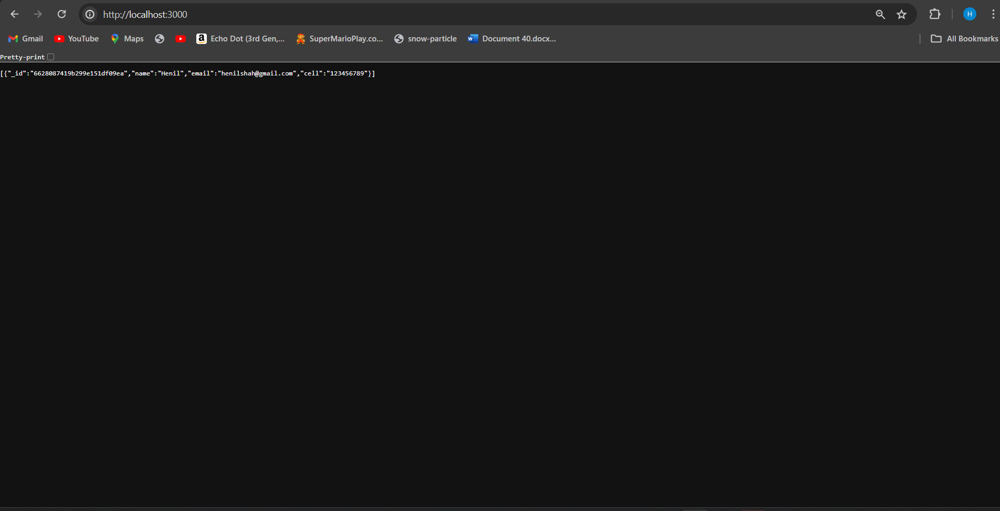

## Overview
Welcome to the world of Docker! This guide will walk you through the basics of Docker containerization, from understanding Docker images to running containers. By the end, you'll have a solid foundation for using Docker to simplify your development and deployment workflows.

Docker is an open-source platform that enables developers to build, ship, and run applications in lightweight containers. Containers package all the necessary dependencies and libraries required to run an application, ensuring consistency across different environments.

### Docker Images

A Docker image is a lightweight, standalone, executable package that contains everything needed to run a piece of software, including the code, runtime, libraries, and dependencies. Images are the building blocks of containers.

### Docker Containers

A Docker container is a runtime instance of a Docker image. Containers run isolated from each other and from the host system, ensuring that applications behave consistently across different environments.

### Dockerfile

A Dockerfile is a text file that contains instructions for building a Docker image. It specifies the base image, dependencies, and commands needed to set up the environment for running the application.

## Use Case

In modern software development, deploying applications efficiently is crucial. Docker has emerged as a popular solution for containerization, enabling developers to package their applications and dependencies into containers for easy deployment across different environments. Docker Compose, a tool for defining and running multi-container Docker applications, further streamlines this process by allowing you to define all your services in a single YAML file.

This repository offers a Dockerized setup for deploying a simple web application stack consisting of MongoDB, MongoDB Express, an application server, and a web server. Docker and Docker Compose are utilized to streamline the deployment process.

## Prerequisites

- Docker installed on your system ([Install Docker](https://docs.docker.com/get-docker/))
- Docker Compose installed on your system ([Install Docker Compose](https://docs.docker.com/compose/install/))

## Getting Started

1. **Clone this repository:**

    ```bash
    git clone https://github.com/karanr1184/docker-IA2.git
    cd docker-web-app
    ```

2. **Pull the required Docker images:**

    ```bash
    docker pull mongo
    docker pull mongo-express
    ```

3. **Create a Docker volume for MongoDB data persistence:**

    ```bash
    docker volume create app-volume
    ```

4. **Build the application server image:**

    ```bash
    docker build -t app-server ./app-server
    ```

5. **Build the web server image:**

    ```bash
    docker build -t web-server ./web-server
    ```

6. **Push the built images to Docker Hub (replace `your-username` with your Docker Hub username):**

    ```bash
    docker image build -t your-username/web-server .
    docker image push your-username/web-server

    docker image build -t your-username/app-server .
    docker image push your-username/app-server
    ```

7. **Deploy the application stack using Docker Compose:**

    ```bash
    docker-compose up
    ```
    **Output**
    
    

## Configuration

The Docker Compose file (`docker-compose.yaml`) defines the services and their configurations. You can adjust the ports, environment variables, and other settings according to your requirements.

## Contributing


Contributions are welcome! Feel free to open issues or pull requests for any improvements or suggestions.


